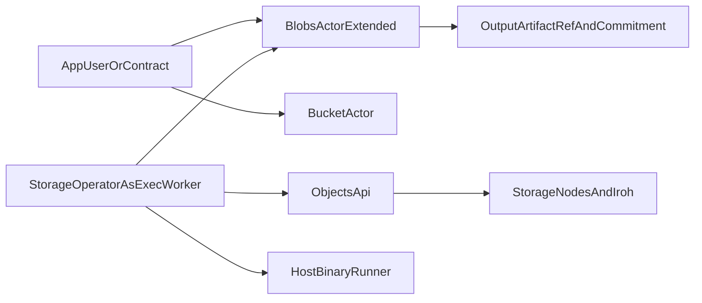

name: Execution Layer MVP
overview: Add a minimal execution layer by extending the existing blobs/storage stack, reusing current operator identity and storage artifact flow, with feature-gated CLI/runtime changes.
todos:
  - id: define-exec-methods-in-blobs
    content: Define execution job methods and state model inside existing blobs actor with minimal new types.
    status: pending
  - id: implement-blobs-actor-extension
    content: Implement execution methods in blobs actor/system paths and shared method params without creating a new actor crate.
    status: pending
  - id: add-node-run-executor
    content: Add run-executor subcommand to existing storage node binary and implement claim-execute-upload-complete loop.
    status: pending
  - id: extend-ipc-cli-exec
    content: Extend ipc-cli with feature-gated exec commands for submit/list/status and basic operator controls.
    status: pending
  - id: artifact-ref-reuse
    content: Reuse existing storage artifact reference patterns with minimal new schema for job inputs/outputs.
    status: pending
  - id: e2e-tests-and-demo
    content: Add actor and CLI integration tests plus end-to-end demo from upload to job completion and output retrieval.
    status: pending
isProject: false
---

# Execution Layer MVP Plan

## Goal

Build a minimal MVP for `artifact in -> off-chain execution -> artifact out -> on-chain commitment` by extending what already exists, not introducing parallel stacks.

## Scope (Locked)

- Use **existing storage operator identity** for execution workers in MVP (single operator entity).
- Runtime model: **host-binary execution** (no container/WASM yet).
- Keep large data off-chain; chain stores only compact job/control metadata and output commitments.
- Keep user UX in **one CLI**: extend `ipc-cli` and gate new commands behind `--features ipc-storage`.

## Reuse Existing Foundations

- Artifact storage + retrieval + distribution:
  - `[ipc-storage/ipc-decentralized-storage/src/objects.rs](ipc-storage/ipc-decentralized-storage/src/objects.rs)`
  - `[ipc-storage/ipc-decentralized-storage/src/distribution.rs](ipc-storage/ipc-decentralized-storage/src/distribution.rs)`
  - `[ipc-storage/ipc-decentralized-storage/src/retrieval.rs](ipc-storage/ipc-decentralized-storage/src/retrieval.rs)`
- Blob lifecycle + credit/accounting:
  - `[fendermint/actors/blobs/src/actor/user.rs](fendermint/actors/blobs/src/actor/user.rs)`
  - `[fendermint/actors/blobs/src/actor/system.rs](fendermint/actors/blobs/src/actor/system.rs)`
  - `[fendermint/actors/blobs/src/state/credit/methods.rs](fendermint/actors/blobs/src/state/credit/methods.rs)`
- Bucket object references (path-based artifact handles):
  - `[fendermint/actors/bucket/src/actor.rs](fendermint/actors/bucket/src/actor.rs)`
- Existing operator registration + active list:
  - `[fendermint/actors/blobs/src/actor/system.rs](fendermint/actors/blobs/src/actor/system.rs)`
  - `[fendermint/actors/blobs/src/state/operators.rs](fendermint/actors/blobs/src/state/operators.rs)`
- Existing storage runtime entrypoints:
  - `[ipc-storage/ipc-decentralized-storage/src/bin/node.rs](ipc-storage/ipc-decentralized-storage/src/bin/node.rs)`
  - `[ipc-storage/ipc-decentralized-storage/src/bin/gateway.rs](ipc-storage/ipc-decentralized-storage/src/bin/gateway.rs)`
- Existing CLI integration point:
  - `[ipc/cli/src](ipc/cli/src)`

## Proposed Architecture

## Workstream 1: Extend Existing Blobs Actor (No New Actor)

Implement execution jobs directly in `blobs` actor for MVP simplicity.

- Add execution methods to shared method enum / dispatch and state:
  - `CreateJob(binary_artifact_ref, input_artifact_refs[], params, timeout)`
  - `CreateJob(binary_artifact_ref, input_artifact_refs[], params, env_allowlist, timeout)`
  - `ClaimJob(job_id)`
  - `HeartbeatJob(job_id)` (optional MVP-lite)
  - `CompleteJob(job_id, output_artifact_refs[], output_commitment, exit_code, timing)`
  - `FailJob(job_id, reason, exit_code)`
  - Queries: `GetJob`, `ListPendingJobs`
- State model:
  - Reuse blobs active operator set as eligible execution workers
  - Job queue and status state machine: `Pending -> Claimed -> Running -> Succeeded|Failed|TimedOut`
  - Compact artifact references only (bucket/key or blob hash), no raw bytes.

## Workstream 2: Reuse Node Binary for Worker Runtime

Add executor loop to existing storage node binary as a new subcommand.

- Add subcommand:
  - `ipc-storage/ipc-decentralized-storage/src/bin/node.rs` -> `run-executor`
- Loop behavior:
  - Poll blobs execution job queue for pending jobs.
  - Claim job atomically.
  - Resolve/fetch binary + inputs from Objects API/storage references.
  - Execute host binary with controlled env/args and timeout.
  - Capture stdout/stderr + exit code + duration.
  - Upload outputs/log artifacts via existing Objects API.
  - Submit `CompleteJob`/`FailJob` with output refs + digest commitment.

## Workstream 3: Artifact Reference Reuse (Minimal New Types)

Define a minimal artifact reference schema and align with existing bucket/blob usage.

- MVP reference shape:
  - `ArtifactRef { bucket_address, key, blob_hash_optional, size_optional }`
- Job request includes:
  - `binary_ref: ArtifactRef`
  - `inputs: Vec<ArtifactRef>`
  - `params: bytes/json`
  - `expected_outputs: manifest hint` (optional)
- Job result includes:
  - `outputs: Vec<ArtifactRef>`
  - `output_manifest_hash` (sha256/blake3)
  - `exit_code`, `started_at`, `finished_at`

## Workstream 4: CLI UX in One Place (`ipc-cli`)

Expose both storage and execution through one CLI interface.

- Add feature-gated commands under `ipc-cli` (only with `ipc-storage` feature):
  - `ipc-cli storage ...` (existing)
  - `ipc-cli exec submit`
  - `ipc-cli exec list`
  - `ipc-cli exec status`
  - `ipc-cli exec logs` (reads output/log artifact references)
- Keep RPC/actor interactions aligned with existing delegated sender patterns.

## Workstream 5: Security Rails (Minimal, Practical)

Given host-binary runtime, add only essential safety checks.

- Restrict job claiming to active storage operators (shared identity).
- Enforce timeout and output/log size limits.
- Sanitize env passthrough with explicit allowlist.
- Keep deterministic execution metadata for audit.

## Workstream 6: Payment and Accounting Integration

Reuse existing upload/storage payment path for artifacts; keep execution incentives minimal.

- Inputs/outputs remain normal artifacts in bucket/blobs path, therefore covered by existing credit accounting flow.
- No staking/slashing/reward market in MVP.
- Optional MVP+ hook: per-job fee/escrow field (tracked, not distributed).

## Workstream 7: Tests and Demo Flow

- Actor unit tests:
  - claim eligibility via shared operator set
  - claim exclusivity
  - valid status transitions
  - timeout/failure handling
- Worker integration test:
  - create job -> claim -> execute sample binary -> upload outputs -> complete on-chain.
- End-to-end demo script:
  - upload binary artifact + input artifact
  - submit job
  - run worker
  - query completed job and download output artifact.

## Delivery Phases

1. **Phase A (Actor extension):** add job lifecycle methods/state inside blobs actor.
2. **Phase B (Executor runtime):** add `node run-executor` loop.
3. **Phase C (CLI UX):** add `ipc-cli exec ...` commands behind `ipc-storage` feature.
4. **Phase D (Hardening + docs):** limits/safety checks, README/demo, observability counters.

## Out of Scope (for this MVP)

- PDP challenge integration for compute correctness.
- Separate execution actor crate.
- Open worker market, staking, slashing.
- Container/WASM runtime.
- Read-ticket economy changes.

## Acceptance Criteria

- User can register artifacts using existing storage path.
- User can create a job using `ipc-cli exec submit` that references uploaded artifacts.
- A storage operator can run `node run-executor`, execute the host binary, and upload outputs.
- Chain records compact result commitment and output artifact refs in extended blobs actor state.
- Downstream job can consume previous output artifact ref as new input.
