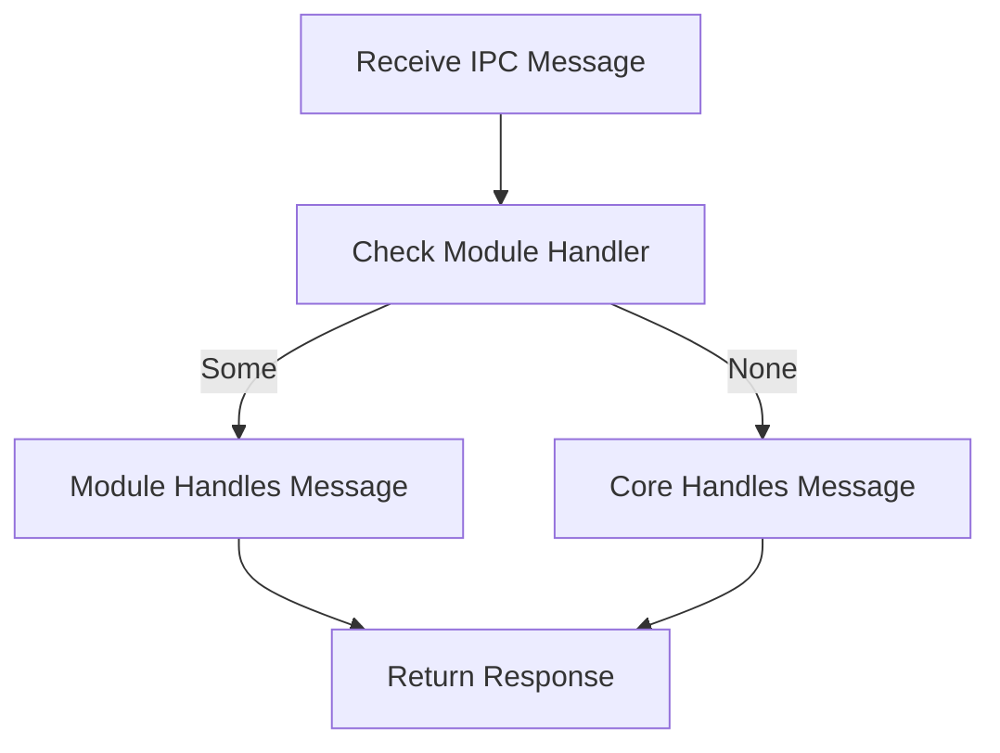

# IPC Module System - Architecture Design Document

**Version:** 1.0
**Date:** December 2024
**Status:** Implemented

---

## Table of Contents

1. [Executive Summary](#1-executive-summary)
2. [System Overview](#2-system-overview)
3. [Core Architecture](#3-core-architecture)
4. [Module Trait System](#4-module-trait-system)
5. [Plugin Discovery & Loading](#5-plugin-discovery--loading)
6. [Reference Implementation: Storage-Node](#6-reference-implementation-storage-node)
7. [Integration Points](#7-integration-points)
8. [Development Guide](#8-development-guide)
9. [Best Practices](#9-best-practices)

---

## 1. Executive Summary

### 1.1 Purpose

This document specifies the architecture of the IPC Module System, a compile-time plugin framework that enables extensibility of the Fendermint node without modifying core code. The system is designed to support features like storage-node functionality while maintaining zero-cost abstractions and type safety.

### 1.2 Goals

1. **Zero-Cost Abstraction** - No runtime overhead compared to hard-coded implementations
2. **Compile-Time Selection** - Modules selected via Cargo feature flags
3. **Type Safety** - Leverage Rust's type system to prevent incorrect integrations
4. **Minimal Boilerplate** - Simple trait-based API for module authors
5. **Auto-Discovery** - Build script automatically detects available modules
6. **Core Independence** - Core Fendermint has no knowledge of specific modules

### 1.3 Non-Goals

- Dynamic library loading (`.so`/`.dll` plugins)
- Runtime plugin discovery or hot-reloading
- Plugin marketplace or versioning system
- Sandboxing or security isolation between modules

### 1.4 Key Design Decisions

| Decision | Rationale |
|----------|-----------|
| Compile-time only | Zero runtime overhead, full optimization, type safety |
| Trait-based hooks | Idiomatic Rust, composable, testable |
| Feature-flag selection | Standard Cargo mechanism, well-understood |
| Build script discovery | No hardcoded plugin names, extensible |
| ModuleBundle composition | Single coherent interface for all capabilities |

---

## 2. System Overview

### 2.1 Architecture Layers

```
┌─────────────────────────────────────────────────────────────┐
│                    Application Layer                         │
│                  (fendermint/app)                           │
│  ┌──────────────┐ ┌──────────────┐ ┌──────────────┐       │
│  │   Node.rs    │ │  Genesis.rs  │ │    CLI       │       │
│  └──────┬───────┘ └──────┬───────┘ └──────┬───────┘       │
└─────────┼────────────────┼────────────────┼────────────────┘
          │                │                │
          │    Uses ModuleBundle<M>        │
          │                │                │
┌─────────▼────────────────▼────────────────▼────────────────┐
│                    Module System API                        │
│                 (fendermint/module)                         │
│  ┌──────────────────────────────────────────────────────┐  │
│  │              ModuleBundle Trait                      │  │
│  │  ┌──────────┐ ┌──────────┐ ┌──────────┐ ┌────────┐ │  │
│  │  │Executor  │ │ Message  │ │ Genesis  │ │Service │ │  │
│  │  │  Module  │ │ Handler  │ │  Module  │ │ Module │ │  │
│  │  └──────────┘ └──────────┘ └──────────┘ └────────┘ │  │
│  │  ┌──────────┐                                        │  │
│  │  │   CLI    │                                        │  │
│  │  │  Module  │                                        │  │
│  │  └──────────┘                                        │  │
│  └──────────────────────────────────────────────────────┘  │
└────────────────────────┬────────────────────────────────────┘
                         │
          ┌──────────────┴──────────────┐
          │                             │
┌─────────▼─────────┐         ┌─────────▼─────────┐
│  NoOpModuleBundle │         │ Concrete Modules  │
│   (default impl)  │         │  (plugins/*)      │
│  ┌─────────────┐  │         │  ┌─────────────┐  │
│  │  No custom  │  │         │  │ Storage-Node│  │
│  │    logic    │  │         │  │   Module    │  │
│  └─────────────┘  │         │  └─────────────┘  │
└───────────────────┘         └───────────────────┘
```

### 2.2 Component Responsibilities

| Component | Responsibility | Location |
|-----------|----------------|----------|
| **Module API** | Define trait interfaces | `fendermint/module/src/` |
| **Module Bundle** | Compose all module traits | `fendermint/module/src/bundle.rs` |
| **NoOp Implementation** | Default behavior (no extensions) | `fendermint/module/src/` |
| **Build Script** | Auto-discover plugins | `fendermint/app/build.rs` |
| **Concrete Modules** | Actual implementations | `plugins/*/` |
| **Application** | Use generic `ModuleBundle<M>` | `fendermint/app/src/` |

---

## 3. Core Architecture

### 3.1 Compile-Time Generics

The system uses Rust generics with trait bounds to achieve zero-cost abstraction:

```rust
// Core types become generic over ModuleBundle
pub struct App<M: ModuleBundle> {
    module: Arc<M>,
    // ... other fields
}

// At compile time, M is resolved to either:
// - NoOpModuleBundle (default)
// - StorageNodeModule (with feature flag)
```

This ensures:
- No virtual dispatch overhead
- Full compiler optimization across module boundaries
- Type errors caught at compile time
- No runtime type checking

### 3.2 Static vs Dynamic Dispatch

| Aspect | Our Approach | Alternative (dyn Trait) |
|--------|--------------|-------------------------|
| Dispatch | Static (monomorphization) | Dynamic (vtable) |
| Performance | Zero overhead | Small overhead per call |
| Binary size | Larger (per-module copy) | Smaller (shared code) |
| Optimization | Full cross-module inlining | Limited optimization |
| Type safety | Compile-time errors | Runtime type checks |

**Decision:** Static dispatch chosen for maximum performance in consensus-critical code.

### 3.3 Feature Flag Configuration

```toml
# fendermint/app/Cargo.toml
[features]
default = []
plugin-storage-node = ["dep:ipc_plugin_storage_node"]

[dependencies]
# Core always included
fendermint_module = { path = "../module" }

# Plugin included only when feature enabled
ipc_plugin_storage_node = {
    path = "../../plugins/storage-node",
    optional = true
}
```

**Build commands:**
```bash
# Default build (no plugins)
cargo build

# With storage-node plugin
cargo build --features plugin-storage-node
```

---

## 4. Module Trait System

### 4.1 ModuleBundle Trait

The `ModuleBundle` trait composes all five module capabilities into a single interface:

```rust
pub trait ModuleBundle:
    ExecutorModule<Self::Kernel>
    + MessageHandlerModule
    + GenesisModule
    + ServiceModule
    + CliModule
    + Send + Sync + 'static
where
    <<Self::Kernel as Kernel>::CallManager as CallManager>::Machine: Send,
{
    type Kernel: Kernel;

    fn name(&self) -> &'static str;
    fn version(&self) -> &'static str { "0.1.0" }
    fn description(&self) -> &'static str { "No description" }
}
```

**Key Properties:**
- Inherits all five module traits (super-trait bounds)
- Associates a Kernel type for FVM execution
- Requires `Send + Sync + 'static` for use across threads
- Machine must be `Send` for async operations

### 4.2 ExecutorModule Trait

Allows modules to customize FVM message execution:

```rust
pub trait ExecutorModule<K: Kernel>
where
    <K::CallManager as CallManager>::Machine: Send,
{
    type Executor: Executor<Kernel = K>
        + Deref<Target = <K::CallManager as CallManager>::Machine>
        + DerefMut;

    fn create_executor(
        engine_pool: EnginePool,
        machine: <K::CallManager as CallManager>::Machine,
    ) -> Result<Self::Executor>;
}
```

**Purpose:** Enable custom execution logic (e.g., RecallExecutor for storage-node)

**Requirements:**
- Executor must implement FVM's `Executor` trait
- Must implement `Deref/DerefMut` to access underlying Machine
- Machine must be `Send` for async context

**Example Use Case:** Storage-node uses `RecallExecutor` to integrate multi-party gas accounting.

### 4.3 MessageHandlerModule Trait

Allows modules to handle custom IPC message types:

```rust
#[async_trait]
pub trait MessageHandlerModule {
    async fn handle_message<DB: Blockstore + Send + Sync>(
        &self,
        state: &mut dyn MessageHandlerState,
        msg: &IpcMessage,
    ) -> Result<Option<ApplyMessageResponse>>;

    fn message_types(&self) -> &[&str];

    async fn validate_message(&self, msg: &IpcMessage) -> Result<bool>;
}
```

**Message Flow:**
1. Core interpreter receives IPC message
2. Queries module: "Can you handle this?"
3. Module returns `Some(response)` if it handles it, `None` otherwise
4. Core continues with standard processing if `None`

**Example:** Storage-node handles `ReadRequestPending` and `ReadRequestClosed` messages.

### 4.4 GenesisModule Trait

Allows modules to initialize actors during genesis:

```rust
pub trait GenesisModule {
    fn initialize_actors<S: GenesisState>(
        &self,
        state: &mut S,
        genesis: &Genesis,
    ) -> Result<()>;

    fn name(&self) -> &str;
    fn validate_genesis(&self, genesis: &Genesis) -> Result<()>;
}
```

**GenesisState Abstraction:**
```rust
pub trait GenesisState: Send + Sync {
    fn blockstore(&self) -> &dyn Blockstore;
    fn create_actor(&mut self, addr: &Address, actor: ActorState) -> Result<ActorID>;
    fn put_cbor_raw(&self, data: &[u8]) -> Result<Cid>;
    fn create_custom_actor(
        &mut self,
        name: &str,
        id: ActorID,
        state: &impl Serialize,
        balance: TokenAmount,
        delegated_address: Option<Address>,
    ) -> Result<()>;
}
```

**Example:** Storage-node initializes storage_config, storage_blobs, and storage_bucket actors.

### 4.5 ServiceModule Trait

Allows modules to start background services:

```rust
#[async_trait]
pub trait ServiceModule {
    async fn initialize_services(
        &self,
        ctx: &ServiceContext,
    ) -> Result<Vec<JoinHandle<()>>>;

    fn resources(&self) -> ModuleResources;
    async fn health_check(&self) -> Result<bool>;
    async fn shutdown(&self) -> Result<()>;
}
```

**ServiceContext:**
```rust
pub struct ServiceContext {
    pub settings: Arc<Settings>,
    pub validator_keypair: Option<Keypair>,
    pub db: Arc<RocksDb>,
    pub state_store: Arc<dyn Blockstore>,
    pub tendermint_client: HttpClient,
    // ... other shared resources
}
```

**Example:** Storage-node spawns IrohResolver tasks and vote publishing loops.

### 4.6 CliModule Trait

Allows modules to add CLI commands:

```rust
#[async_trait]
pub trait CliModule {
    fn commands(&self) -> Vec<CommandDef>;
    async fn execute(&self, args: &CommandArgs) -> Result<()>;
    fn validate_args(&self, args: &CommandArgs) -> Result<()>;
    fn complete(&self, command: &str, arg: &str) -> Vec<String>;
}
```

**CommandDef Structure:**
```rust
pub struct CommandDef {
    pub name: String,
    pub about: String,
    pub long_about: Option<String>,
    pub args: Vec<ArgDef>,
}
```

**Example:** Storage-node adds `objects` command for blob management.

---

## 5. Plugin Discovery & Loading

### 5.1 Build Script (build.rs)

Located at `fendermint/app/build.rs`, this script runs at compile time:

```rust
fn main() {
    // 1. Scan plugins/ directory
    let plugins_dir = Path::new("../../plugins");

    // 2. For each subdirectory:
    //    - Check if CARGO_FEATURE_PLUGIN_<NAME> env var is set
    //    - If set, generate import code

    // 3. Generate type alias:
    //    type DiscoveredModule = plugin_name::ModuleType;

    // 4. Generate loading function:
    //    fn load_discovered_plugin() -> Arc<DiscoveredModule>
}
```

**Output:** `discovered_plugins.rs` in `OUT_DIR`

### 5.2 Generated Code Example

When `--features plugin-storage-node` is enabled:

```rust
// Auto-generated by build.rs - DO NOT EDIT

#[cfg(feature = "plugin-storage-node")]
extern crate ipc_plugin_storage_node as plugin_storage_node;

#[cfg(feature = "plugin-storage-node")]
pub type DiscoveredModule = plugin_storage_node::StorageNodeModule;

#[cfg(not(feature = "plugin-storage-node"))]
pub type DiscoveredModule = fendermint_module::NoOpModuleBundle;

pub fn load_discovered_plugin() -> Arc<DiscoveredModule> {
    #[cfg(feature = "plugin-storage-node")]
    {
        tracing::info!("Auto-discovered plugin: storage-node");
        return Arc::new(plugin_storage_node::create_plugin());
    }

    tracing::info!("No plugin enabled, using NoOpModuleBundle");
    Arc::new(DiscoveredModule::default())
}
```

### 5.3 Application Integration

```rust
// fendermint/app/src/lib.rs

// Include generated code
include!(concat!(env!("OUT_DIR"), "/discovered_plugins.rs"));

// Use in application
pub struct App<M: ModuleBundle = DiscoveredModule> {
    module: Arc<M>,
    // ...
}

impl App<DiscoveredModule> {
    pub fn new() -> Self {
        let module = load_discovered_plugin();
        Self { module, /* ... */ }
    }
}
```

**Key Property:** Application code never mentions specific plugin names!

### 5.4 Naming Conventions

For auto-discovery to work, plugins must follow these conventions:

| Convention | Example | Requirement |
|------------|---------|-------------|
| Directory | `plugins/storage-node/` | Under `plugins/` |
| Crate name | `ipc_plugin_storage_node` | `ipc_plugin_<name>` |
| Feature flag | `plugin-storage-node` | `plugin-<name>` |
| Constructor | `create_plugin()` | Returns module instance |

---

## 6. Reference Implementation: Storage-Node

### 6.1 Module Structure

```
plugins/storage-node/
├── Cargo.toml
└── src/
    ├── lib.rs                    # Main module implementation
    ├── actor_interface/          # Actor type definitions
    ├── helpers/                  # Genesis helpers
    │   └── genesis.rs
    ├── resolver/                 # IPLD resolution
    ├── service_resources.rs      # Service context types
    ├── storage_env.rs            # BlobPool, ReadRequestPool
    ├── storage_helpers.rs        # FVM integration helpers
    └── topdown_types.rs          # IPCBlobFinality, etc.
```

### 6.2 Module Implementation

```rust
// plugins/storage-node/src/lib.rs

pub struct StorageNodeModule;

impl ModuleBundle for StorageNodeModule {
    type Kernel = fvm::DefaultKernel<
        DefaultCallManager<DefaultMachine<MemoryBlockstore, NoOpExterns>>
    >;

    fn name(&self) -> &'static str { "storage-node" }
    fn version(&self) -> &'static str { "0.1.0" }
    fn description(&self) -> &'static str {
        "Storage node module with RecallExecutor integration"
    }
}

// Plugin constructor (required for auto-discovery)
pub fn create_plugin() -> StorageNodeModule {
    StorageNodeModule::default()
}
```

### 6.3 ExecutorModule Implementation

```rust
impl<K> ExecutorModule<K> for StorageNodeModule
where
    K: Kernel,
    <<K as Kernel>::CallManager as CallManager>::Machine: Send,
{
    type Executor = RecallExecutor<K>;

    fn create_executor(
        engine: EnginePool,
        machine: <<K as Kernel>::CallManager as CallManager>::Machine,
    ) -> Result<Self::Executor> {
        RecallExecutor::new(engine, machine)
    }
}
```

**RecallExecutor Features:**
- Multi-party gas accounting
- Gas allowance tracking
- Wraps standard FVM executor
- Implements `Deref/DerefMut` to expose Machine

### 6.4 MessageHandlerModule Implementation

```rust
#[async_trait]
impl MessageHandlerModule for StorageNodeModule {
    async fn handle_message<DB: Blockstore + Send + Sync>(
        &self,
        state: &mut dyn MessageHandlerState,
        msg: &IpcMessage,
    ) -> Result<Option<ApplyMessageResponse>> {
        match msg {
            IpcMessage::ReadRequestPending(req) => {
                // Handle read request initialization
                Ok(Some(/* response */))
            }
            IpcMessage::ReadRequestClosed(req) => {
                // Handle read request completion
                Ok(Some(/* response */))
            }
            _ => Ok(None), // Not our message
        }
    }

    fn message_types(&self) -> &[&str] {
        &["ReadRequestPending", "ReadRequestClosed"]
    }
}
```

### 6.5 GenesisModule Implementation

```rust
impl GenesisModule for StorageNodeModule {
    fn initialize_actors<S: GenesisState>(
        &self,
        state: &mut S,
        genesis: &Genesis,
    ) -> Result<()> {
        // 1. Create storage_config actor
        state.create_custom_actor(
            "storage_config",
            STORAGE_CONFIG_ACTOR_ID,
            &StorageConfigState::default(),
            TokenAmount::zero(),
            None,
        )?;

        // 2. Create storage_blobs actor
        state.create_custom_actor(
            "storage_blobs",
            BLOBS_ACTOR_ID,
            &BlobsState::default(),
            TokenAmount::zero(),
            Some(BLOBS_ACTOR_ADDR),
        )?;

        // 3. Additional actors...

        Ok(())
    }

    fn name(&self) -> &str { "storage-node" }
}
```

### 6.6 Storage-Node Dependencies

The storage-node module depends on actors located in `storage-node/`:

```
storage-node/
├── actors/
│   ├── storage_config/         # Configuration actor
│   ├── storage_blobs/          # Blob management actor
│   ├── storage_bucket/         # Bucket management actor
│   ├── storage_blob_reader/    # Read request handler
│   └── storage_timehub/        # Time-based operations
├── executor/
│   └── src/lib.rs              # RecallExecutor implementation
├── kernel/                      # Custom kernel for storage ops
└── ipld/                        # IPLD data structures
```

---

## 7. Integration Points

### 7.1 Application Startup Flow

```rust
// 1. Load plugin at startup
let module = load_discovered_plugin(); // Arc<DiscoveredModule>

// 2. Create interpreter with module
let interpreter = FvmMessagesInterpreter::new(
    module.clone(),
    // ... other params
)?;

// 3. Genesis initialization
module.initialize_actors(&mut genesis_state, &genesis)?;

// 4. Start services
let service_handles = module.initialize_services(&service_ctx).await?;

// 5. Run application
app.run().await?;

// 6. Shutdown
module.shutdown().await?;
```

### 7.2 Message Processing Flow



```rust
// In FvmMessagesInterpreter
async fn apply_message(&self, msg: ChainMessage) -> Result<ApplyRet> {
    match msg {
        ChainMessage::Ipc(ipc_msg) => {
            // Try module first
            if let Some(response) = self.module.handle_message(
                &mut state,
                &ipc_msg
            ).await? {
                return Ok(response);
            }

            // Fall back to core handling
            match ipc_msg {
                IpcMessage::TopDownExec(finality) => { /* ... */ }
                // ... other core messages
            }
        }
    }
}
```

### 7.3 Genesis Integration

```rust
// In genesis executor
pub fn execute_genesis<M: ModuleBundle>(
    module: &M,
    genesis: &Genesis,
) -> Result<Cid> {
    let mut state = FvmGenesisState::new(/* ... */);

    // 1. Initialize core actors (system, init, cron, etc.)
    initialize_core_actors(&mut state, genesis)?;

    // 2. Let module initialize its actors
    module.initialize_actors(&mut state, genesis)?;

    // 3. Finalize state tree
    let state_root = state.flush()?;
    Ok(state_root)
}
```

### 7.4 Service Lifecycle

```rust
// In node service startup
pub async fn run(settings: Settings) -> Result<()> {
    let module = load_discovered_plugin();

    // Create service context
    let ctx = ServiceContext {
        settings: Arc::new(settings),
        validator_keypair,
        db: Arc::new(db),
        state_store: Arc::new(state_store),
        tendermint_client,
    };

    // Let module start services
    let mut handles = module.initialize_services(&ctx).await?;

    // Start core services
    handles.push(spawn_consensus_loop());
    handles.push(spawn_rpc_server());

    // Wait for shutdown signal
    tokio::signal::ctrl_c().await?;

    // Shutdown module
    module.shutdown().await?;

    // Wait for all tasks
    for handle in handles {
        handle.await?;
    }

    Ok(())
}
```

---

## 8. Development Guide

### 8.1 Creating a New Module

**Step 1: Create Plugin Directory**
```bash
mkdir -p plugins/my-module/src
cd plugins/my-module
```

**Step 2: Create Cargo.toml**
```toml
[package]
name = "ipc_plugin_my_module"  # MUST follow this pattern!
version = "0.1.0"
edition = "2021"

[dependencies]
fendermint_module = { path = "../../fendermint/module" }
fvm = "4.0"
fvm_shared = "4.0"
async-trait = "0.1"
anyhow = "1.0"
tokio = { version = "1.35", features = ["full"] }
```

**Step 3: Implement Module Bundle**
```rust
// src/lib.rs
use fendermint_module::prelude::*;

#[derive(Debug, Clone, Default)]
pub struct MyModule;

// REQUIRED: Export create_plugin function
pub fn create_plugin() -> MyModule {
    MyModule::default()
}

impl ModuleBundle for MyModule {
    type Kernel = fvm::DefaultKernel</* ... */>;

    fn name(&self) -> &'static str { "my-module" }
    fn version(&self) -> &'static str { env!("CARGO_PKG_VERSION") }
    fn description(&self) -> &'static str {
        "My custom module"
    }
}

// Implement each sub-trait (see below)
```

**Step 4: Implement ExecutorModule**
```rust
impl<K> ExecutorModule<K> for MyModule
where
    K: Kernel,
    <K::CallManager as CallManager>::Machine: Send,
{
    type Executor = MyCustomExecutor<K>;

    fn create_executor(
        engine_pool: EnginePool,
        machine: <K::CallManager as CallManager>::Machine,
    ) -> Result<Self::Executor> {
        MyCustomExecutor::new(engine_pool, machine)
    }
}
```

**Step 5: Implement MessageHandlerModule**
```rust
#[async_trait]
impl MessageHandlerModule for MyModule {
    async fn handle_message<DB: Blockstore + Send + Sync>(
        &self,
        state: &mut dyn MessageHandlerState,
        msg: &IpcMessage,
    ) -> Result<Option<ApplyMessageResponse>> {
        // Return Some(response) if you handle it, None otherwise
        Ok(None)
    }

    fn message_types(&self) -> &[&str] {
        &[] // List message types you handle
    }

    async fn validate_message(&self, msg: &IpcMessage) -> Result<bool> {
        Ok(true)
    }
}
```

**Step 6: Implement GenesisModule**
```rust
impl GenesisModule for MyModule {
    fn initialize_actors<S: GenesisState>(
        &self,
        state: &mut S,
        genesis: &Genesis,
    ) -> Result<()> {
        // Initialize your actors here
        Ok(())
    }

    fn name(&self) -> &str {
        "my-module"
    }

    fn validate_genesis(&self, genesis: &Genesis) -> Result<()> {
        Ok(())
    }
}
```

**Step 7: Implement ServiceModule**
```rust
#[async_trait]
impl ServiceModule for MyModule {
    async fn initialize_services(
        &self,
        ctx: &ServiceContext,
    ) -> Result<Vec<tokio::task::JoinHandle<()>>> {
        // Spawn background tasks, return handles
        Ok(vec![])
    }

    fn resources(&self) -> ModuleResources {
        ModuleResources::empty()
    }

    async fn health_check(&self) -> Result<bool> {
        Ok(true)
    }

    async fn shutdown(&self) -> Result<()> {
        Ok(())
    }
}
```

**Step 8: Implement CliModule**
```rust
#[async_trait]
impl CliModule for MyModule {
    fn commands(&self) -> Vec<CommandDef> {
        vec![]
    }

    async fn execute(&self, args: &CommandArgs) -> Result<()> {
        Ok(())
    }

    fn validate_args(&self, args: &CommandArgs) -> Result<()> {
        Ok(())
    }

    fn complete(&self, command: &str, arg: &str) -> Vec<String> {
        vec![]
    }
}
```

**Step 9: Add to Workspace**
```toml
# Root Cargo.toml
[workspace]
members = [
    # ...
    "plugins/my-module",
]
```

**Step 10: Add Feature Flag**
```toml
# fendermint/app/Cargo.toml
[dependencies]
ipc_plugin_my_module = { path = "../../plugins/my-module", optional = true }

[features]
plugin-my-module = ["dep:ipc_plugin_my_module"]
```

**Step 11: Build and Test**
```bash
# Build with your module
cargo build --features plugin-my-module

# Test with your module
cargo test --features plugin-my-module

# Default build (without your module)
cargo build
```

### 8.2 Testing Modules

**Unit Tests:**
```rust
#[cfg(test)]
mod tests {
    use super::*;

    #[test]
    fn test_module_name() {
        let module = MyModule;
        assert_eq!(ModuleBundle::name(&module), "my-module");
    }

    #[tokio::test]
    async fn test_health_check() {
        let module = MyModule;
        assert!(module.health_check().await.is_ok());
    }
}
```

**Integration Tests:**
```rust
// tests/integration_test.rs
#[tokio::test]
async fn test_genesis_initialization() {
    let module = create_plugin();
    let genesis = Genesis::default();
    let mut state = MockGenesisState::new();

    let result = module.initialize_actors(&mut state, &genesis);
    assert!(result.is_ok());
}
```

### 8.3 Debugging

**Enable logging:**
```bash
RUST_LOG=debug cargo run --features plugin-my-module
```

**Check plugin discovery:**
```bash
# Build with verbose output
cargo build --features plugin-my-module --verbose 2>&1 | grep "Discovered plugin"
```

**Inspect generated code:**
```bash
# Find OUT_DIR location
cargo build --features plugin-my-module --verbose 2>&1 | grep "Running.*build script"

# Then inspect the generated file
cat target/debug/build/fendermint-app-*/out/discovered_plugins.rs
```

---

## 9. Best Practices

### 9.1 Module Design

**DO:**
- ✅ Keep modules focused on a single concern
- ✅ Use the `Result` type for all fallible operations
- ✅ Provide meaningful error messages
- ✅ Implement `Debug` for all types
- ✅ Document public APIs with `///` comments
- ✅ Use `tracing` for logging, not `println!`
- ✅ Return `None` from `handle_message` if not your message
- ✅ Make background tasks cancellable via `CancellationToken`

**DON'T:**
- ❌ Hard-code configuration values
- ❌ Use unwrap() in production code
- ❌ Block async functions with synchronous I/O
- ❌ Ignore shutdown signals
- ❌ Leak resources in error paths
- ❌ Modify core Fendermint code
- ❌ Assume other modules are present

### 9.2 Error Handling

```rust
use anyhow::{Context, Result, bail};

// Good: Add context to errors
fn my_function() -> Result<()> {
    do_something()
        .context("failed to do something")?;
    Ok(())
}

// Good: Use bail! for early returns
fn validate(value: u64) -> Result<()> {
    if value == 0 {
        bail!("value must be non-zero");
    }
    Ok(())
}
```

### 9.3 Performance Considerations

**Avoid allocations in hot paths:**
```rust
// Bad: Allocates on every call
fn get_name(&self) -> String {
    "my-module".to_string()
}

// Good: Returns static string
fn name(&self) -> &'static str {
    "my-module"
}
```

**Use appropriate data structures:**
```rust
// Use Vec for sequential access
let items: Vec<Item> = vec![];

// Use HashMap for lookups
let cache: HashMap<Key, Value> = HashMap::new();

// Use BTreeMap for sorted iteration
let sorted: BTreeMap<Key, Value> = BTreeMap::new();
```

**Minimize clones:**
```rust
// Bad: Unnecessary clone
fn process(&self, data: Vec<u8>) {
    let copy = data.clone();
    // ...
}

// Good: Borrow when possible
fn process(&self, data: &[u8]) {
    // ...
}
```

### 9.4 Async Best Practices

**Use `tokio::spawn` for concurrent tasks:**
```rust
async fn initialize_services(&self, ctx: &ServiceContext)
    -> Result<Vec<JoinHandle<()>>>
{
    let mut handles = vec![];

    // Spawn task 1
    handles.push(tokio::spawn(async move {
        task1().await;
    }));

    // Spawn task 2
    handles.push(tokio::spawn(async move {
        task2().await;
    }));

    Ok(handles)
}
```

**Handle cancellation gracefully:**
```rust
async fn service_loop(cancel: CancellationToken) {
    loop {
        tokio::select! {
            _ = cancel.cancelled() => {
                tracing::info!("Shutting down gracefully");
                break;
            }
            result = do_work() => {
                if let Err(e) = result {
                    tracing::error!("Work failed: {}", e);
                }
            }
        }
    }
}
```

### 9.5 Logging Guidelines

```rust
use tracing::{debug, info, warn, error};

// Use structured logging
tracing::info!(
    module = "my-module",
    actor_id = %actor.id,
    "Initialized actor"
);

// Use appropriate levels
debug!("Detailed debug information");
info!("High-level informational message");
warn!("Warning: unexpected but recoverable");
error!("Error occurred: {}", err);

// Don't log in hot loops
// Bad:
for item in items {
    info!("Processing {}", item); // Too noisy!
}

// Good:
info!("Processing {} items", items.len());
for item in items {
    // ...
}
info!("Completed processing");
```

### 9.6 Documentation Standards

```rust
/// Brief one-line description.
///
/// Longer description with more details about what this does,
/// why it exists, and how to use it.
///
/// # Arguments
///
/// * `param1` - Description of param1
/// * `param2` - Description of param2
///
/// # Returns
///
/// Description of return value
///
/// # Errors
///
/// This function returns an error if:
/// - Condition 1
/// - Condition 2
///
/// # Examples
///
/// ```ignore
/// let result = my_function(42, "test")?;
/// ```
pub fn my_function(param1: u64, param2: &str) -> Result<Value> {
    // Implementation
}
```

---

## Appendix A: Type System Deep Dive

### A.1 Kernel Type Parameters

The Kernel type parameter propagates through the entire system:

```rust
ModuleBundle::Kernel = K
  └─> ExecutorModule::Executor::Kernel = K
      └─> Executor::Kernel = K
          └─> CallManager (associated type)
              └─> Machine (associated type)
```

Example concrete type:
```rust
type MyKernel = fvm::DefaultKernel<
    DefaultCallManager<
        DefaultMachine<
            MemoryBlockstore,
            NoOpExterns
        >
    >
>;
```

### A.2 Machine Send Requirement

The `Machine: Send` bound appears throughout because:
1. FVM operations are async (require Send for cross-await)
2. Executor may be used from multiple async contexts
3. State tree access happens across await points

Without `Send`, compilation would fail with:
```
error[E0277]: `Machine` cannot be sent between threads safely
```

### A.3 Trait Object Safety

Some traits are not object-safe (can't use `dyn Trait`):

```rust
// Not object-safe (generic method)
trait ExecutorModule<K: Kernel> {
    type Executor;
    fn create_executor(...) -> Result<Self::Executor>;
}

// Object-safe version would need:
trait DynExecutorModule {
    fn create_executor_dyn(...) -> Result<Box<dyn Executor>>;
}
```

We use static dispatch (generics) instead of trait objects for:
- Zero-cost abstraction
- Full type information at compile time
- Better optimization opportunities

---

## Appendix B: Comparison with Alternatives

### B.1 vs Hard-Coded Feature Flags

| Aspect | Module System | Feature Flags |
|--------|---------------|---------------|
| Core changes | None needed | Scattered `#[cfg]` |
| Extensibility | Easy (drop in plugins/) | Hard (modify core) |
| Testing | Mock modules | Mock implementations |
| Compile time | Slightly longer | Faster |
| Runtime overhead | Zero | Zero |
| Maintainability | High | Low (conditional spaghetti) |

### B.2 vs Dynamic Libraries (.so/.dll)

| Aspect | Module System | Dynamic Libs |
|--------|---------------|--------------|
| Loading | Compile-time | Runtime |
| Performance | Zero overhead | Function call overhead |
| Type safety | Full | Limited (FFI boundary) |
| ABI stability | Not needed | Critical concern |
| Versioning | Cargo | Manual |
| Distribution | Source code | Binaries |

### B.3 vs Trait Objects (dyn Trait)

| Aspect | Module System | Trait Objects |
|--------|---------------|---------------|
| Dispatch | Static | Virtual (vtable) |
| Associated types | Yes | No |
| Generic methods | Yes | No |
| Performance | Inline + optimize | Indirect call |
| Binary size | Larger | Smaller |

---

## Appendix C: Future Enhancements

### C.1 Potential Improvements

1. **Multiple Plugin Support**
   - Currently: One plugin at a time
   - Future: Compose multiple plugins
   - Challenge: Type system complexity

2. **Plugin Dependencies**
   - Currently: Plugins are independent
   - Future: Plugin A depends on Plugin B
   - Challenge: Circular dependencies

3. **Configuration Schema**
   - Currently: Ad-hoc configuration
   - Future: Typed config with validation
   - Example: `#[derive(ModuleConfig)]`

4. **Hot Reloading**
   - Currently: Compile-time only
   - Future: Runtime plugin updates
   - Challenge: State migration

5. **Plugin Marketplace**
   - Currently: Local plugins only
   - Future: Centralized plugin registry
   - Similar to crates.io for modules

### C.2 Known Limitations

1. **Single Module Restriction**
   - Can only enable one plugin per build
   - Workaround: Create composite module

2. **No Runtime Discovery**
   - Plugins must be known at compile time
   - Can't discover plugins from filesystem

3. **Type Complexity**
   - Associated types propagate everywhere
   - Can be challenging for newcomers

4. **Build Time**
   - Monomorphization increases compile time
   - Each plugin creates separate code paths

---

## Revision History

| Version | Date | Author | Changes |
|---------|------|--------|---------|
| 1.0 | Dec 2024 | IPC Team | Initial architecture document |

---

**Document Status:** Complete
**Implementation Status:** Functional (storage-node module operational)
**Next Review:** Q1 2025
