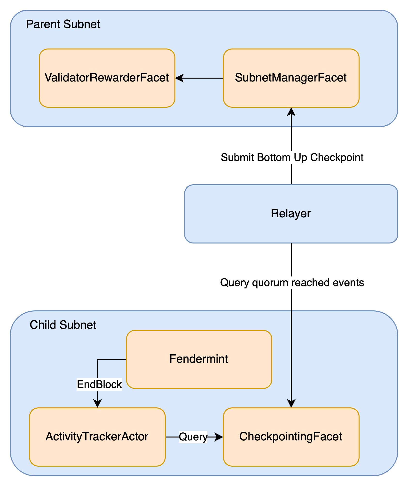

# Subnet activities roll up

## Overview
This doc introduces the notion of child subnet rolls up its activities through bottom-up checkpoints to its parent. 
This is a mechanism to synthesise and propagate selective information about the activity that occurred inside a subnet to the parent.
The definition of `Activity` can be application specific, but generally, it represents critical information about the child subnet that
is valuable and can be acted upon in the parent(if there is one). Some sample activities could be:
- The blocks mined by each validator
- The total number of blocks mined in between bottom up checkpoints.
- ...

The parent can choose to either relay this information up the hierarchy, or consume the incoming report for some effect, such as:
- rewarding validators by minting a token
- rebalancing the validator set based on performance metrics
- tracking subnet state
- ...

For each application, it is possible to define its own `Activity` struct to handle different scenarios, but IPC tracks 
the blocks mined by each validator and total number of blocks mined in between bottom up checkpoints out of the box.

## Overall flow
The key idea is that child subnet tracks these activities and submits `commitment` to the parent subnet through bottom up
checkpoints. In the parent to trigger downstream effects, one needs to provide proofs to interact with the activities in the child subnet. 
As an example, consider validator rewarding. The commitment is a merkle root over the blocks mined by each validator. This root is carried 
to the parent as part of the bottom up checkpoint. The validator can claim its reward in the parent subnet by submitting a 
merkle proof. The merkle proof can be deduced from child subnet.

The key components are shown below:

- Activity tracker actor: A fvm actor that tracks and aggregates the blockchain's activities. It allows querying and purging of subnet activities. 
- Bottom up checkpoint: The bottom up checkpoint contains the commitment to subnet activities.
- Diamond facets: The different diamond facets to handle the follow-ups in the parent. IPC ships with `ValidatorRewardFacet` by default, but one can choose not to deploy it if not needed.

## Key data models
The overall activity struct submitted in the child subnet is FullActivityRollUp. It carries a set of aggregated reports on various aspects of the 
activity that took place in the subnet between the previous checkpoint and the checkpoint this summary is committed into. If this is the 
first checkpoint, the summary contains information about the subnet's activity since genesis.

The first report we introduce is the consensus level report. This report contains:
- Aggregated block mining stats: 
  - Total active validators: the total number of unique validators that have mined within this period.
  - Total number of blocks committed: the total number of blocks committed by all validators during this period.
- Validator data: Contains an array of addresses and blocks mined for each validator. One can add more fields to track more activities, such as uptime metrics .

We emit the full activities roll up as a local event, `ActivityRollupRecorded`, in the subnet, for stakeholders (e.g. validators) to monitor and present 
any relevant payloads up in the hierarchy to trigger downstream effects.

Over time, `FullActivityRollUp` can bloat, e.g. if the validator count in a subnet grows. When combined with xnet messages, the checkpoint size can become large, 
which has detrimental effects on gas costs at the parent, and could even potentially exceed message size limits. Therefore, instead of embedding 
the payloads in the checkpoint, we use a compressed summary in the bottom up checkpoint: CompressedActivityRollup. This struct contains the distilled information
that is critical to the parent subnet. At the moment, it contains the consensus level summary for validator rewarding.

## Activity tacking in child subnet
TODO

## Roll up in action
Once the activities are tracked in the child subnet, fendermint will generate the compressed summary and attach it as part of the bottom up checkpoint.
The generation of the compressed summary for each report could be different and generally application specific.
Once a quorum is reached in the child subnet, the relayer will submit the bottom up checkpoint to the parent subnet actor. Since the compressed 
summary is part of the bottom up checkpoint, the compressed summary is forwarded to the parent subnet.

## Validator rewards
For IPC, the validator rewarding mechanism is shipped out of the box. When the bottom up checkpoint is constructed, fendermint will query all 
validator mining details from the activity tracker. It aggregates the number of blocks mined for each validator and merklize over the array. 
Note that the validators are sorted by their address and blocks mined for unique ordering.
Since the `FullActivityRollUp` contains all validators' mining activities, validator can filter the `ActivityRollupRecorded` events against 
fendermint's eth rpc endpoints to obtain the full list of activities to derive the merkle proof. There is an `ipc-cli` command to help validators 
claim the reward.

The bottom up checkpoint submitted in the parent subnet will initialize a new reward distribution for that checkpoint height. When a validator claims 
the reward, the subnet actor will verify the merkle proof for the pending checkpoint height, and call the ValidatorRewarder implementation if it 
succeeds, marking the fragment as claimed in its state, so it cannot be double claimed.

IPC `ValidatorRewarderFacet` tracks the claim history of each validator to avoid double claiming. However, the detailed reward distribution 
logic is actually handled by a custom contract, namely `IValidatorRewarder`. When the subnet is created, the creator can specify the address 
of the validator rewarder implementation and when eligible validator claims the reward, the subnet actor will pass the validator address and 
blocks mined to the rewarder implementation. As an example, the rewarder implementation could mint erc20 based on the parameters sent from subnet 
actor.