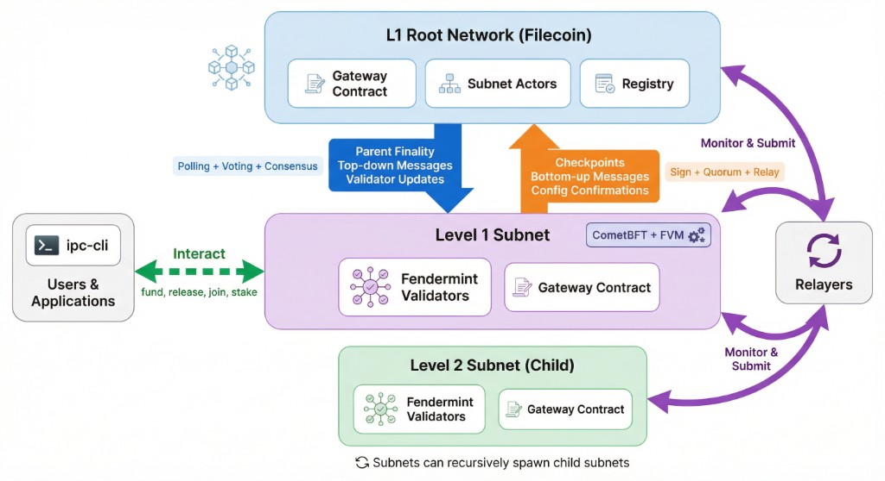
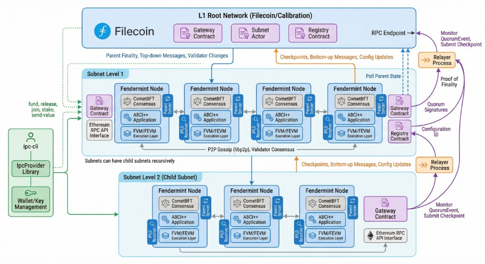
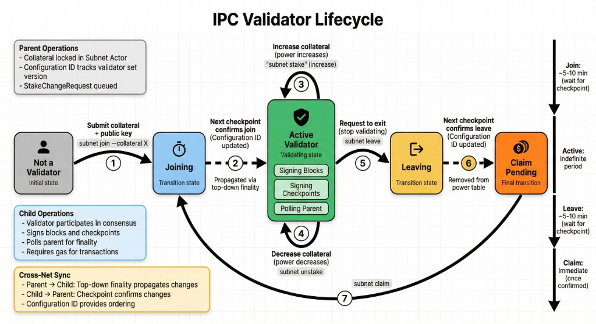
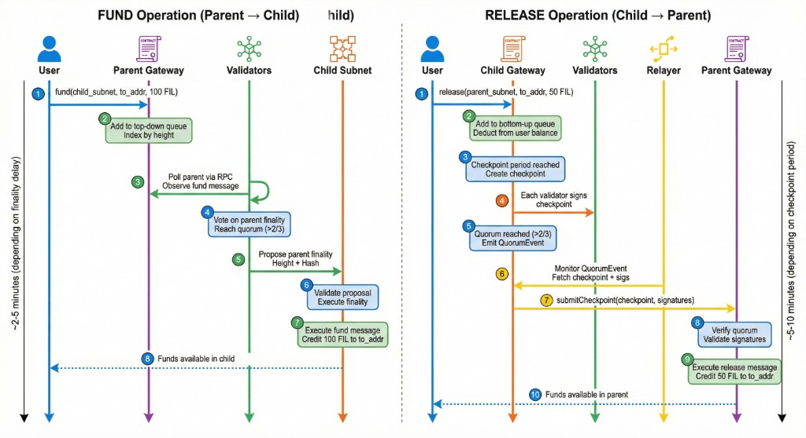

# IPC Protocol Capture

> Protocol capture document describing how IPC works, components, mechanisms, status, open questions, and dependencies.

## Table of Contents

1. [Intro / Overview](#intro--overview)
2. [Primitives & Definitions](#primitives--definitions)
3. [Concepts (Mechanisms)](#concepts-mechanisms)
4. [Components](#components)
5. [Operation](#operation)
6. [Security Guarantees](#security-guarantees)
7. [Configuration](#configuration)
8. [Dependencies](#dependencies)
9. [Appendices](#appendices)

---

## Intro / Overview

### Introduction

**InterPlanetary Consensus (IPC)** is a flexible blockchain extensibility solution—a **sidechain system** in which users can delegate operations to dedicated autonomous blockchains (subnets) whose state is anchored back into higher-security, less-capable chains. Subnets can be further extended with lower-level subnets in a **recursive** manner.

IPC subnets are full, sufficiently **decentralized** blockchains **owning their data**, unlike rollups that rely on centralized sequencers and post significant data to the main chain. Subnets are **highly configurable**, **specialized**, and **fine-tuned**. IPC imposes **minimal requirements** on the target chain’s capabilities; subnets can even be anchored into chains with limited programmability (e.g., Bitcoin). Anchoring subnet state into higher-security chains provides **checkpoint-based objectivity**, facilitating dynamic joining and light clients secured against long-range attacks without social consensus. Transitively checkpointing into a common chain establishes **eventual consistency** across autonomous subnets, improving **composability** and coordination of cross-chain operations.

### Features

| Feature | Description |
|---------|-------------|
| **Recursive scalability** | Subnets can spawn child subnets indefinitely, forming a tree hierarchy |
| **Cross-net communication** | Secure message passing between parent and child (top-down and bottom-up) |
| **Flexible consensus** | Each subnet can customize block time, validator requirements, and consensus parameters. *Currently only CometBFT is implemented; rollups and sequencer-based subnets are intended.* |
| **Ethereum compatibility** | Full FEVM support for Solidity smart contracts |
| **Native FVM support** | Access to Filecoin's actor model and built-in capabilities |

**Expanded capability areas** (from conceptual framing):

- **Dynamic scalability**: Subnets optimized for performance; checkpoint-based objectivity enables trustless bootstrapping; elastic scaling through programmatic launch/termination
- **Customizability**: Configurable consensus, execution (WASM & EVM), tokenomics, data availability, governance; permissioned or permissionless; regional or application-specific
- **Seamless interoperability**: Native cross-chain communication; protocol-native bridging secured by checkpointing; eventual consistency across subnets
- **Autonomy & sovereignty**: Subnets govern lifecycle, configuration, validator sets; partition tolerance (local finality when disconnected)
- **Objective security**: Checkpoint-based objectivity; trust anchors verifiable without social consensus; long-range attack mitigation
- **Risk containment**: Security boundaries between subnets; failures confined to affected subnet

### Core Concepts

| Concept | Definition |
|---------|------------|
| [Subnet](#subnet) | Autonomous blockchain whose state is anchored into a parent chain |
| [Parent chain](#parent-chain) | Blockchain that a subnet anchors into |
| [Rootnet](#rootnet) | Blockchain with no parent (e.g., Filecoin) |
| [Subnet ID](#subnet-id) | Address identifying the subnet (root chain ID + route of subnet actor addresses) |
| [Checkpoint](#checkpoint) | Periodic commitment of subnet state to parent; cryptographic reference to finalized chain head |
| [Cross-net messages](#cross-net-message) | Messages between chains; top-down (deposits) and bottom-up (withdrawals) |

> **Note**: Currently, cross-net messages are supported for directly linked chains only (single-hop parent↔subnet). See [Primitives & Definitions](#primitives--definitions) for fuller definitions.
>
> **Implementation status**: Only CometBFT-based subnets are implemented today. The protocol is designed to support other consensus mechanisms (e.g., rollups, sequencer-based subnets); these are intended but not yet implemented.

### How IPC Works (Conceptual)

IPC combines several mechanisms:

- **Checkpointing**: Anchors subnet state into parent; ensures checkpoints correspond to actual state; enables bridging
- **Bridging**: Secures transfer of information and assets; relies on checkpointing; uses cross-net messages
- **Subnet ID management**: Governs subnet ID namespaces and assignment
- **Subnet lifecycle management**: Registration, activation, termination
- **Subnet configuration management**: Validator set, voting power, config updates

**Flow**: Given a rootnet (root of trust), new subnets obtain a subnet ID and register. Lifecycle management governs activation (e.g., collateral for PoS). Configuration management handles validator set and updates. Subnets operate autonomously; checkpoints periodically bind state to parent. Bridging uses the same cross-net message carrier for deposits (lock+mint) and withdrawals (burn+release).

### Key Principles

*Proposed from protocol design goals—to be refined:*

- **Objectivity**: Checkpoint-based trust anchors; no social consensus required
- **Autonomy**: Self-governance, self-sovereignty; subnets own their data
- **Impact containment**: Firewalling; failures isolated to affected subnet
- **Flexibility**: Modularity, customizability, extensibility
- **Dynamicity**: On-demand scaling, elasticity
- **Partition tolerance**: Local finality when disconnected; consistency restored on reconnection
- **Seamless interoperability**: Native cross-net communication; eventual consistency

### Requirements & Properties

*Proposed placement: overlaps with [Security Guarantees](#security-guarantees) (trust assumptions) and [Configuration](#configuration) (constraints). Could be a short subsection here or consolidated there.*

- **Core assumptions**: Rootnet exists and is trusted; >2/3 validator honesty; reliable parent RPC
- **Constraints**: Single-hop messaging (current); supply source immutability
- **Guarantees**: Message integrity, ordering, value safety, risk containment

---

## Primitives & Definitions

*Canonical definitions—reference these from [Concepts](#concepts-mechanisms) and [Components](#components) to avoid repetition.*

### ABCI++

Application Blockchain Interface. Protocol for CometBFT to communicate with the application layer. Defines `PrepareProposal`, `ProcessProposal`, and `FinalizeBlock`.

### Bottom-up

Information flow from child subnet to parent. Includes [checkpoints](#checkpoint) and bottom-up messages (e.g., [withdrawals](#withdrawal)). Propagated by the [Relayer](#relayer).

### Checkpoint

Batch of child subnet state and bottom-up messages submitted to the parent with validator signatures. Contains: subnet_id, block_height, block_hash, prev_checkpoint_height, cross_messages, next_configuration_number. Block hash anchors against long-range attacks. Created by validators; submitted by the [Relayer](#relayer); validated by the parent [Gateway](#gateway).

### Configuration ID

Version number for the validator set. Increments when [StakeChangeRequest](#stakechangerequest)s (join, leave, stake, unstake) are applied. Child confirms adoption via `next_configuration_number` in [checkpoints](#checkpoint); parent releases collateral when checkpoint is committed.

### Cross-net message

Message sent between chains. [Top-down](#top-down) (parent→child) or [bottom-up](#bottom-up) (child→parent). Carried in an [IpcEnvelope](#ipcenvelope). Currently single-hop (direct parent↔child) only.

### Deposit

[Top-down](#top-down) message carrying assets. Implemented as `fund` (native) or `fundWithToken` (ERC20) on the [Gateway](#gateway).

### Gateway

Singleton contract in every subnet. Manages collateral, firewall, cross-net routing, and [checkpoint](#checkpoint) validation. Executes top-down and bottom-up messages. Participates in [checkpointing](#checkpointing), [messaging](#messaging), and [bridging](#bridging).

### IpcEnvelope

Structure carrying a cross-net message: kind (Transfer, Call, Result), from/to ([Subnet ID](#subnet-id) + address), value, message bytes, nonces. Used for routing via [postbox](#postbox) and [LCA](#lca-lowest-common-ancestor) determination.

### LCA (Lowest Common Ancestor)

Subnet in the hierarchy that is an ancestor of both source and destination. Used to route [cross-net messages](#cross-net-message) and determine top-down vs bottom-up direction.

### Parent chain

Blockchain that a subnet anchors into. Hosts the [Subnet Actor](#subnet-actor) for each child; receives [checkpoints](#checkpoint) from children.

### Parent finality

Child subnet’s committed view of which parent block is final. Validators vote on parent (height, hash) via GossipSub; VoteTally detects quorum; proposer includes `ParentFinality` in the child block. Triggers execution of top-down messages.

### Postbox

Storage on intermediate subnets for [cross-net messages](#cross-net-message) in transit. Messages are propagated from the postbox to the next hop (parent or child) based on routing.

### Quorum

>2/3 of validator power. Threshold for checkpoint signing, parent finality votes, and BFT consensus.

### Registry

Factory contract for deploying reference [Subnet Actor](#subnet-actor) implementations. One per subnet.

### Relayer

Off-chain process that monitors the child subnet for `QuorumReached` events, retrieves the signed [checkpoint](#checkpoint) and validator signatures, and submits it to the parent [Gateway](#gateway). Performs the submission step of [checkpointing](#checkpointing). Permissionless; requires L1 funds.

### Rootnet

Blockchain with no parent (e.g., Filecoin). Root of trust for the IPC hierarchy.

### StakeChangeRequest

Request for validator set change (join, leave, stake, unstake, setFederatedPower). Identified by [configuration ID](#configuration-id). Propagated via [parent finality](#parent-finality); executed in child; confirmed in [checkpoint](#checkpoint).

### Subnet

Autonomous blockchain whose state is anchored into a [parent chain](#parent-chain). Has its own validators, consensus, and execution. Can spawn child subnets recursively.

### Subnet Actor

Contract governing a specific child subnet. Deployed in the parent. Defines [supply source](#supply-source), genesis, permission mode. One [Subnet Actor](#subnet-actor) per child subnet. Calls `register` on parent [Gateway](#gateway) when bootstrap conditions are met.

### Subnet ID

Address identifying a subnet. Format: root (chain ID) + route (array of [Subnet Actor](#subnet-actor) addresses top-to-bottom). String representation: `/r314159/t410f.../t410f...`. Assigned when [Subnet Actor](#subnet-actor) is deployed.

### Supply Source

Source of subnet native coin. **Native**: parent’s native coin (e.g., FIL). **ERC20**: ERC20 on parent locked, minted in subnet. Set at subnet creation; immutable.

### Top-down

Information flow from parent to child. Includes [parent finality](#parent-finality), top-down messages (e.g., [deposits](#deposit)), and validator set changes. Propagated via parent finality commitment in child blocks.

### VoteTally

*Deprecated — will be removed soon.* Mechanism tracking validator votes on [parent finality](#parent-finality). Detects quorum; informs block proposer which parent block to include.

### Withdrawal

[Bottom-up](#bottom-up) message carrying assets. Implemented as `release` on the [Gateway](#gateway). Batched in [checkpoint](#checkpoint); submitted by [Relayer](#relayer); executed on parent.

---

## Concepts (Mechanisms)

*Abstract/conceptual level—spans multiple components.*

### Subnet ID Management

See [Subnet ID](#subnet-id) for definition. Assigned when [Subnet Actor](#subnet-actor) is deployed (via [Registry](#registry) or custom). Route grows as child subnets are created. Binary: `keccak256(abi.encode(SubnetID))` for equality checks and storage.

### Subnet Lifecycle Management

1. **Creation**: Deploy [Subnet Actor](#subnet-actor) in [parent chain](#parent-chain) (via [Registry](#registry) or custom); configure [supply source](#supply-source), permission mode, genesis
2. **Registration**: Once min validators/collateral met, [Subnet Actor](#subnet-actor) calls `register` on parent [Gateway](#gateway)
3. **Active**: Subnet produces blocks, creates [checkpoints](#checkpoint), processes messages
4. **Termination**: Subnet can be killed (governance-dependent); collateral released per [checkpoint](#checkpoint) confirmation

### Subnet Configuration Management

Validator set and voting power managed on parent, propagated via [top-down](#top-down):

- [StakeChangeRequest](#stakechangerequest)s identified by [configuration ID](#configuration-id)
- Propagated via [parent finality](#parent-finality) commitment in child blocks
- Child executes changes; confirms via `next_configuration_number` in [checkpoint](#checkpoint)
- Parent confirms collateral release when [checkpoint](#checkpoint) is committed

### Checkpointing

Periodically anchors subnet state into parent. See [Checkpoint](#checkpoint) for structure.

**Flow**:
1. Every `bottomup_check_period` blocks (or when `MAX_MSGS_PER_BATCH` hit), validators create [checkpoint](#checkpoint)
2. Validators call `addCheckpointSignature`; [quorum](#quorum) triggers `QuorumReached` event
3. [Relayer](#relayer) submits [checkpoint](#checkpoint) + signatures to parent [Gateway](#gateway)
4. Parent verifies against last known validator set, executes [bottom-up](#bottom-up) messages

### Messaging

Transport layer for cross-subnet communication. [Bridging](#bridging) uses this as transport.

**Flows**: [Top-down](#top-down) (propagated via [parent finality](#parent-finality)) and [bottom-up](#bottom-up) (batched in [checkpoints](#checkpoint), submitted by [Relayer](#relayer)).

**Types**: Transfer ([deposit](#deposit)/[withdrawal](#withdrawal)), Call (general contract-to-contract), Result (response). Mechanisms: [IpcEnvelope](#ipcenvelope), [postbox](#postbox), [LCA](#lca-lowest-common-ancestor) routing.

### Bridging

Moving value/assets between subnets—built on [messaging](#messaging). Uses [Gateway](#gateway) for native flows.

**Native**: [Supply source](#supply-source). [Deposit](#deposit)/[withdrawal](#withdrawal) for native; lock+mint / burn+release for ERC20.

**Custom**: Linked Token pattern for arbitrary ERC20s via general [cross-net messages](#cross-net-message). Lock on origin, mint on target; burn on target, release on origin.

### Consensus

- **Subnet consensus**: CometBFT (BFT, [quorum](#quorum)) — *currently the only implemented consensus mechanism*. Rollups and sequencer-based subnets are intended future implementations.
- **[Parent finality](#parent-finality)**: Validators poll parent, vote via GossipSub; [VoteTally](#votetally) detects quorum; proposer includes `ParentFinality` in block

### On-Chain vs Off-Chain

| Aspect | On-Chain | Off-Chain |
|--------|----------|-----------|
| [Gateway](#gateway), [Subnet Actor](#subnet-actor), [Registry](#registry) | ✓ | |
| Message execution, [checkpoint](#checkpoint) validation | ✓ | |
| Consensus (CometBFT) | Runs on nodes | |
| Parent Syncer, IPLD Resolver | | Polls/resolves |
| [Relayer](#relayer), IPC Provider, ipc-cli | | Submits, queries, signs |

---

## Components

### Actors (WASM)

IPC subnets run the **FVM**, which executes **WASM-based actors** (Filecoin execution model):

- Built-in actors (Account, Init, EVM, etc.)
- Custom actors deployable by subnets
- Shared across root (Lotus) and child subnets (Fendermint)

### Contracts (Solidity) — Onchain Actors

**Status**: 🔴 *Needs consolidation with implementation details*

| Contract | Location | Responsibility |
|----------|----------|----------------|
| **[Gateway](#gateway)** | Singleton in every subnet | Collateral, firewall, cross-net routing, [checkpoint](#checkpoint) validation |
| **[Subnet Actor](#subnet-actor)** | One per child, deployed in parent | [Supply source](#supply-source), genesis, permission mode, validator set |
| **[Registry](#registry)** | Per subnet | Factory for [Subnet Actor](#subnet-actor) implementations |

**Architecture**: Diamond pattern (EIP-2535), AppStorage for shared state. Participates in [checkpointing](#checkpointing), [messaging](#messaging), [bridging](#bridging).

### Node (Subnet Validator Node)

**Fendermint** — subnet peer implementation:

| Layer | Component | Responsibility |
|-------|-----------|----------------|
| Consensus | CometBFT | BFT consensus, block proposal, voting, P2P |
| Application | ABCI++ | PrepareProposal, ProcessProposal, FinalizeBlock |
| Execution | FVM/FEVM | Smart contract execution |
| Parent Sync | Parent Syncer | Polls parent RPC, [VoteTally](#votetally) for [parent finality](#parent-finality) |
| Data | IPLD Resolver | CID resolution, data availability |

**Node lifecycle**: Genesis → Bootstrap (register) → Validation → Shutdown (leave/unstake).

### IPC Provider (Parent Chain Provider)

**Status**: 🟢 [needs review]  
**Code**: [ipc/provider/src/lib.rs](https://github.com/consensus-shipyard/ipc/blob/main/ipc/provider/src/lib.rs)

Wraps ethers library and contract ABIs for parent chain interaction. Used by ipc-cli and relayer.

**Responsibilities**:
- Calling parent contracts ([Gateway](#gateway), [Subnet Actor](#subnet-actor), [Registry](#registry))
- Subnet lifecycle interaction (create, join, leave, list)
- Fetching subnet genesis and [top-down](#top-down) queries (messages, validator changes)
- Enabling [Relayer](#relayer) to interact with parent and child

### Relayer (Off-Chain)

**Status**: 🟡

**Overview**: Performs the submission step of [checkpointing](#checkpointing). Monitors child subnet for `QuorumReached` events; assembles [checkpoint](#checkpoint) + validator signatures; submits to parent [Gateway](#gateway) via `submitCheckpoint`.

**Flow**: L2 contract event → retrieve signed [checkpoint](#checkpoint) → construct proofs (CometBFT light client) → submit to L1 for execution.

**Dependencies**: Requires funds on L1 to submit transactions.

**Known issues / improvement areas**:
- Needs better events/observability
- No rewards system for incentivization (message fees exist but mechanism needs refinement)
- First-come-first-serve: issues if relayer goes down; no built-in redundancy protocol

---

## Operation

### Creating & Destroying Subnets

**Create**: Deploy [Subnet Actor](#subnet-actor) via [Registry](#registry) or custom; configure min_validators, min_collateral, [supply source](#supply-source); wait for bootstrap (join + collateral). [Subnet Actor](#subnet-actor) calls `register` on [Gateway](#gateway) when ready.

**Destroy**: Governance-dependent; subnet can be killed; validators leave; collateral released as [checkpoints](#checkpoint) confirm.

### Joining & Leaving Subnets

**Join**: Call `join` on [Subnet Actor](#subnet-actor) with collateral; creates [StakeChangeRequest](#stakechangerequest); propagated via [top-down](#top-down) [parent finality](#parent-finality); child executes; confirmed in [checkpoint](#checkpoint). ~5–10 min.

**Leave**: Call `leave` or `unstake`; same propagation; child removes/reduces; parent releases collateral when [checkpoint](#checkpoint) committed. Claim via `ipc-cli subnet claim`. ~5–10 min to leave; claim is immediate once confirmed.

### Depositing & Withdrawing Assets

**Deposit (fund)**: [Deposit](#deposit)—call `fund` (or `fundWithToken` for ERC20) on parent [Gateway](#gateway); [top-down](#top-down) message; executed in child when [parent finality](#parent-finality) committed. ~2–5 min depending on finality delay.

**Withdraw (release)**: [Withdrawal](#withdrawal)—call `release` on child [Gateway](#gateway); [bottom-up](#bottom-up) message; batched in [checkpoint](#checkpoint); [Relayer](#relayer) submits; executed on parent. ~5–10 min depending on checkpoint period.

### General Message Passing

Contract-to-contract via `sendContractXnetMessage` (Call kind). [IpcEnvelope](#ipcenvelope) carries payload; [postbox](#postbox) routes at intermediate subnets; destination contract implements `handleIpcMessage`. Result messages propagate back. *Currently single-hop for direct parent-child; multi-hop routing supported in protocol.*

---

## Security Guarantees

### Trust Assumptions

1. **L1 Security**: Root network (e.g., Filecoin) is trusted and secure
2. **Validator honesty**: >2/3 of validator power is honest in each subnet
3. **Economic security**: Collateral discourages malicious behavior
4. **Finality delay**: Parent blocks delayed sufficiently to avoid reorgs
5. **RPC reliability**: Validators have access to reliable parent RPC

### Attack Mitigations

| Threat | Mitigation |
|--------|------------|
| Long-range attacks | Block hash anchored in checkpoints |
| Double-spend | BFT consensus + checkpoint finality |
| Validator collusion | Requires >2/3 stake; economically irrational |
| Checkpoint censorship | Multiple relayers provide redundancy |
| Parent reorg | Finality delay ensures stability |

### Guarantees Provided

- **Message integrity**: Envelopes signed/verified
- **Ordering**: Deterministic execution via parent finality and checkpoint ordering
- **Value safety**: Lock-before-mint; burn-before-release
- **Validator set sync**: Configuration number confirms membership; parent releases collateral only after child confirms
- **Risk containment**: Failures isolated to affected subnet

### Caveats

- Security decreases with hierarchy depth
- Federated subnets rely on admin honesty
- Gateway/Registry upgrades may introduce trust

### Economic Incentives

**Top-down**: Gas paid in parent; no additional fee in child.

**Bottom-up**: Cross-message fee paid by sender (rewards relayer); execution gas paid by relayer (compensated by fee); fee set by subnet policy.

**Collateral**: Required for collateral mode; slashing/penalties depend on subnet governance.

---

## Configuration

### Subnet Creation Parameters

| Parameter | Description |
|-----------|-------------|
| `min_validators` | Minimum validators to bootstrap |
| `min_collateral` | Minimum total collateral |
| `bottomup_check_period` | Blocks between checkpoints |
| `active_validators_limit` | Max active validators |
| `majority_percentage` | Quorum threshold (typically 67%) |
| `supply_source_kind` | Native or ERC20 |
| `supply_source_address` | ERC20 address (if ERC20) |

### Operational Parameters

| Parameter | Typical Value | Description |
|-----------|---------------|-------------|
| `finality_delay` | 10–20 blocks | Parent blocks before final |
| `max_proposal_range` | ~50 blocks | Max parent height advance per child block |
| `MAX_MSGS_PER_BATCH` | 100 | Triggers intermediate checkpoint |

### Configuration Files

- **ipc-cli**: `~/.ipc/config.toml` — subnets, keystore_path
- **Fendermint**: `~/.fendermint/config/` — ABCI, DB, resolver, eth RPC

---

## Dependencies

### CometBFT

Consensus engine for subnet blocks. ABCI++ interface. Critical for block production, P2P, proposal/vote flow. *Currently the only implemented subnet consensus mechanism; rollups and sequencer-based subnets are planned.*

### Other Key Dependencies

| Dependency | Usage |
|------------|-------|
| FVM | Execution (WASM, FEVM) |
| IPLD / Bitswap | Data availability, CID resolution |
| Ethers / Foundry | Contracts, testing |
| Filecoin / Lotus | Root network |

---

## Appendices

*Supplementary information: detailed specs, diagrams, implementation notes.*

- [IPC Actors Spec](../../specs/ipc-actors.md)
- [Supply Sources](../../specs/supply-sources.md)
- [Addressing](../../specs/addressing.md)
- [Architecture Overview](./architecture-overview.md)
- [Architecture Quick Reference](./architecture-quick-reference.md)

---

## Merge Notes (v2)

*Mapping from source document to this version:*

| Source Section | Placement |
|----------------|-----------|
| **Introduction, Features, Core Concepts, How IPC Works** | Merged into [Intro / Overview](#intro--overview) |
| **Key Principles** (was TODO) | Added with proposed principles; marked for refinement |
| **Requirements & Properties** (was TODO) | Added as short subsection with note on overlap with Security/Configuration |
| **Abstract/Conceptual Mechanisms** | Same as [Concepts (Mechanisms)](#concepts-mechanisms) — merged |
| **Subnet ID / Lifecycle / Config Management** (were TODO) | Filled from codebase; now under Concepts |
| **Components: Onchain Actors** | → [Contracts (Solidity)](#contracts-solidity--onchain-actors); added status 🔴 |
| **IPC Provider** | Added as new [Component](#ipc-provider-parent-chain-provider); status 🟢 |
| **Relayer** | Enriched with status 🟡, dependencies, known issues |
| **Operation** (was new) | Added new section: Creating/Destroying, Join/Leave, Deposit/Withdraw, General Message Passing |
| **Security & Economics** | [Security Guarantees](#security-guarantees) + new [Economic Incentives](#economic-incentives) subsection |
| **Glossary** | Expanded into [Primitives & Definitions](#primitives--definitions) |
| **Appendices** | Added with links to specs and architecture docs |

---

**Document Version**: 2.0  
**Last Updated**: February 2026  
**Status**: Living document — merge of protocol capture v1 with enriched source. Expand status, issues, open questions per section as needed.
