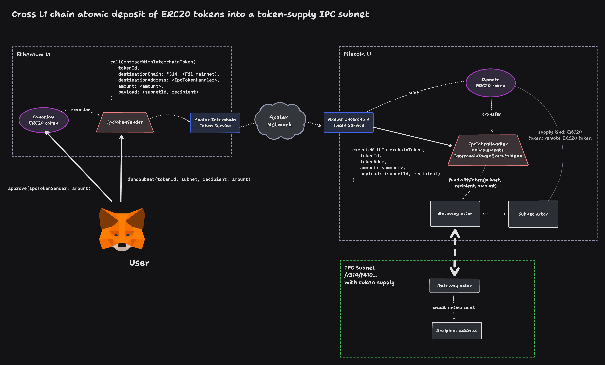

# IPC Axelar Token Example

> Cross L1 chain atomic deposit of ERC20 tokens into token-supply subnets, via the Axelar network.

## Motivation

Imagine an ERC20 token residing on the Ethereum L1.
We'll call this the _canonical token_, with symbol `TOK`.

Then there is an IPC L2 subnet anchored on Filecoin mainnet (L1) wishing to adopt `TOK` as its supply source.

We can leverage the [Axelar Interchain Token Service (ITS)](https://interchain.axelar.dev/) to replicate the canonical token across L1s: from Ethereum to Filecoin.
Doing so creates a remote token on Filecoin managed by the Axelar bridge.
We'll call it `filTOK`.

Using Axelar, users can move `TOK` freely between Ethereum <> Filecoin (the L1s).
Every bridge transaction takes a few minutes to settle (depending on finality, approval, execution).
But once `TOK` arrives to Filecoin in the form of `filTOK`, users would have to sign yet another transaction (this time on Filecoin) to deposit the newly arrived tokens into the IPC L2 subnet.

Sign a tx, wait, switch network, sign another tx. What if we could get rid of this extra step, and perform the transfer and the deposit in one go (atomically)?

## Solution



## Contents

This example contains a duo of contracts leveraging Axelar's General Message Passing (GMP) via the ITS to conduct an atomic transfer and subnet deposit.

**`IpcTokenSender`:** This contract is deployed on the source L1. The user transacts with this contract by calling `fundSubnet()`, passing in the Axelar token ID, the subnet ID, the receipient address within the subnet, and the amount. This transfers the tokens to the destination L1 via the Axelar ITS, addressed to `IpcTokenHandler`, sending the subnet/recipient routing along for the `IpcTokenHandler` to use.

**`IpcTokenHandler`:** This contract is deployed on the destination L1. It implements Axelar's `InterchainTokenExecutable` interface, enabling it to accept and handle tokens and call data forwarded by the Axelar gateway. It proceeds to deposit the received tokens into designated subnet, crediting them to the desired recipient, by calling the IPC gateway.

## Usage

This example comes with some handy scripts to get you started quickly.
But first, you will need to deploy an Axelar Interchain Token in, e.g. Polygon, and replicate it to Filecoin.
You can do that via Axelar's [testnet](https://testnet.interchain.axelar.dev/) or [mainnet](https://interchain.axelar.dev/) ITS portal.
For more information, refer to the [Axelar docs](https://docs.axelar.dev/dev/send-tokens/interchain-tokens/create-token).

1. Copy `.env.example` to `.env`.
2. Adjust the parameters, including the origin and destination chains, token addresses (from the Axelar deployment), and private keys.
3. Deploy the handler contract to the destination chain. The script records the address in `out/addresses.json`, and other scripts automatically pick it up from there.
    ```bash
   $ make deploy-handler
   ```
4. Deploy the sender contract to the origin chain.
   ```bash
   $ make deploy-sender
   ```
5. Try it out. This is an interactive command.
    ```bash
   $ make deposit
    ```

