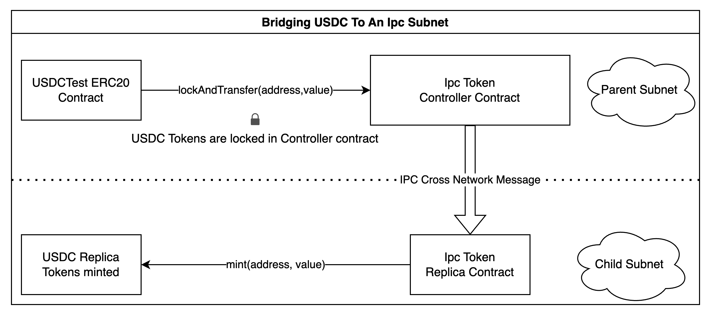
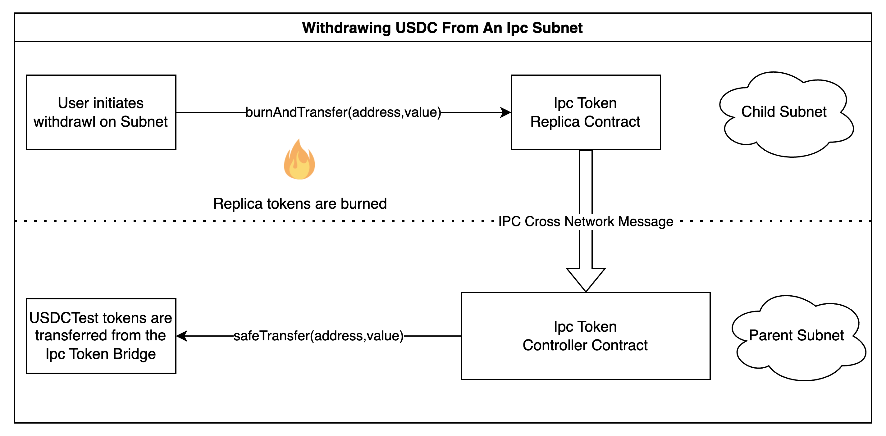

# Linked Token Spec

## Outline for Linked Token Bridge
- Contracts
    - ERC20 token named USDCTest on Calibration Network
    - Token Controller contract on Calibration Network
    - Token Replica contract on subnet
- Workflow
    - Deposit tokens from rootnet to subnet
        - calling the rootBridge.bridgeToken() to lock up USDC tokens and initiate an IPC cross net message to the subnet token bridge
        - subnet token bridge receives IPC message and mints USDC proxy tokens
    - Withdraw tokens from subnet to rootnet
        - call subnetBridge.withdrawToken() to burn proxy USDC tokens on the subnet and initiate an IPC cross net message to the root network bridge

## USDC propagation flow

A high-level overview of the process is shown in the following diagrams:





Setup and instructions for running on calibnet

1. Follow IPC guide for setting up a subnet pinned to the filecoin calibnet network
    1. https://github.com/consensus-shipyard/ipc/blob/main/docs/ipc/quickstart-calibration.md
2. copy the config file from ipc/contracts/script/examples/cross-token/.env.template to .en a config file for connecting to calibnet and your subnet. Create a new wallet with for executing the USDC test that is not one of the validators. You will need to fund this wallet using the calibnet facuet. Set PRIVATE_KEY in .env for this new wallet.
3. Deploy or use a pre-deployed gateway on calibnet
    1. review output of `make deploy-ipc NETWORK=calibrationnet`  in order to get the address of your IPC gateway on the calbnet and add this to your .env file. You should see an output like:

    ```jsx
    "Gateway": "0x5cF14D2Af9BBd5456Ea532639f1DB355B9BaCBf8",
    ```

    b.  add to your .env file:

    ```jsx
    export CALIBNET_GATEWAY=0x5cF14D2Af9BBd5456Ea532639f1DB355B9BaCBf8
    ```

    c.  This gateway should match the gateway in your ~/.ipc/config.toml file

    ```jsx
    gateway_addr = "0x5cF14D2Af9BBd5456Ea532639f1DB355B9BaCBf8"
    registry_addr = "0x7308C4A503a12521215718cbCa98F951E9aAB9B5"
    ```

4. Use a pre-existing subnet or deploy a new one. You will want to ensure that the config file ~/.ipc/confg.toml has a valid gateway and ipc registry. Your subnet id will look something like:

    ```jsx
    ipc-cli subnet create \
    --parent /r314159 \
    --min-validator-stake 10 \
    --min-validators 1 \
    --bottomup-check-period 30 \
    --from 0x684a69080fd214af19215f5f7dfbc9704027e3d6 \
    --permission-mode collateral --supply-source-kind native

    created subnet actor with id: /r314159/t410f2jhadzp7jvo7cuo3r52yoc6fd3q4czxfu5fgbxi

    ```

5. Visit [this tool](https://beryx.zondax.ch/address_converter) and convert the t410f2jhadzp7jvo7cuo3r52yoc6fd3q4czxfu5fgbxi filecoin address to an ethereum format like 0xd24e01e5ff4d5df151db8f75870bc51ee1c166e5
6. Update your .env file to set SUBNET_ROUTE_IN_ETH_FORMAT to be the ethereum format of the subnet address from the previous step

    ```jsx
    export SUBNET_ROUTE_IN_ETH_FORMAT=0x1e0fa8dd65a59399e47cbe6f31766586b41204c3
    ```

7. Set up the validators as specified by the calibration start up guide and ensure we have funded your wallet using a calibnet faucet
8. Fund your wallet’s address on the subnet

    ```jsx
    $ ipc-cli cross-msg fund \
    --subnet /r314159/t410f2jhadzp7jvo7cuo3r52yoc6fd3q4czxfu5fgbxi \
     --from  0xa0e416c85e0117cdbaa8d29137c97a2f4a3c9b8e \
    10
    ```

9. Deploy the USDCTest contract

    ```jsx
    make deploy-usdctest
    ```

    If you see the error

    ```jsx
    Error:
    Transaction dropped from the mempool: 0x563e6ca21d46417020accd05cce992e30f4cb7e69e6b76cc249fea53037bdaa8
    ```

    You can search for the transaction on filfox and find the correct contract address from the other tab under EthAddress: https://calibration.filfox.info/en/message/0x563e6ca21d46417020accd05cce992e30f4cb7e69e6b76cc249fea53037bdaa8?t=4

10. Mint 1000 USDCTest tokens to your wallet

    ```jsx
    make mint-usdc
    ```

11. Check your wallet balance to ensure that the mint was successful

    ```jsx
    make check-balance
    ```

    ```jsx
    0x00000000000000000000000000000000000000000000000000000000000003e8
    ```

    If an output of the following is seen, wait a few minutes for the contraction to finalize

    ```jsx
    0x0000000000000000000000000000000000000000000000000000000000000000
    ```

12. Deploy token replica contract on the subnet. This command should execute fairly quickly because of the subnet’s speed. Use the contract address from the printout indicated below.

    ```jsx
    make deploy-replica
    ```

13. Deploy token controller contract on Calibnet and update our .env file with the new address.

    ```jsx
    make deploy-controller
    ```

14. We must update the replica with the controllers address, and the replica with the controller’s address to complete our setup. Please don’t forget this part!

    ```jsx
    make initialize-replica
    ```

    ```jsx
    make initialize-controller
    ```


# Bridging USDC To the Subnet

1. Approve the Token Controller contract to handle our funds:

    ```jsx
    make approve-usdc
    ```

2. With approval, to deposit 1,000 USDCTest tokens we do the following:

    ```jsx
    make deposit-usdc
    ```

3. Confirm our balance on calbnet has gone to zero

    ```jsx
    make check-balance
    ```

    The expected output is

    ```jsx
    0x0000000000000000000000000000000000000000000000000000000000000000
    ```

    If an output of the following is seen, wait a few minutes for the contraction to finalize

    ```jsx
    0x00000000000000000000000000000000000000000000000000000000000003e8
    ```

4. Validate that our replica token balance is the correct value by running the command

    ```jsx
    make check-replica-balance
    ```

    looking for a value of:

    ```jsx
    0x00000000000000000000000000000000000000000000000000000000000003e8
    ```


# Withdrawing USDC from the Subnet

In order to withdrawal Replica USDCTest from the subnet we must ensure we have a check point relayer with the command:

```jsx
ipc-cli checkpoint relayer \
--subnet /r314159/t410fdyh2rxlfuwjztzd4xzxtc5tfq22bebgdvlx2ofy
```

Then running this command will initiate the withdrawal:

```jsx
make withdraw-usdc
```

We can validate our funds are correctly transfered with make check-replica-balance and make check-balance.
