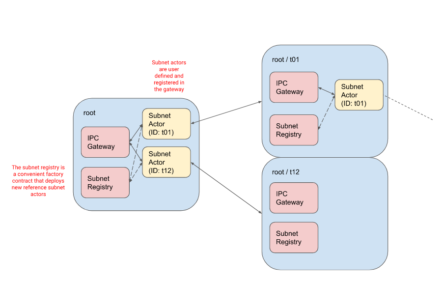
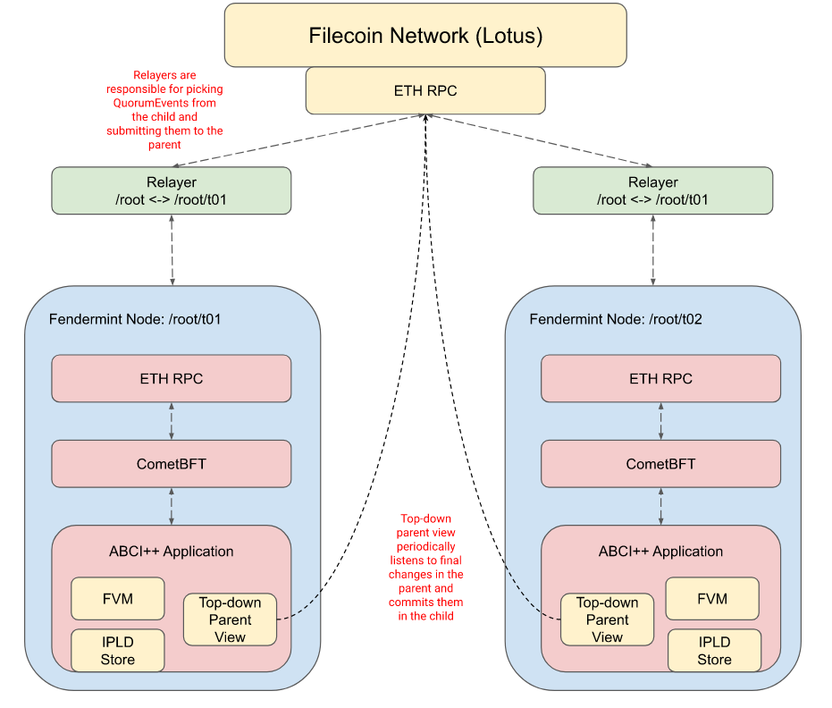
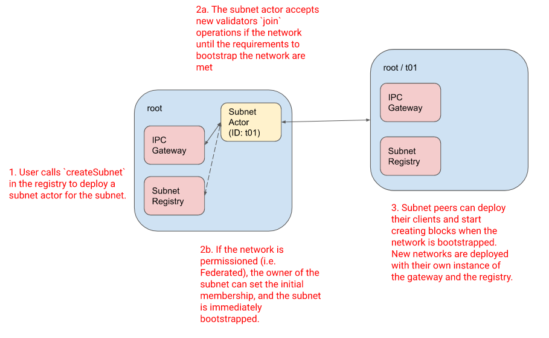
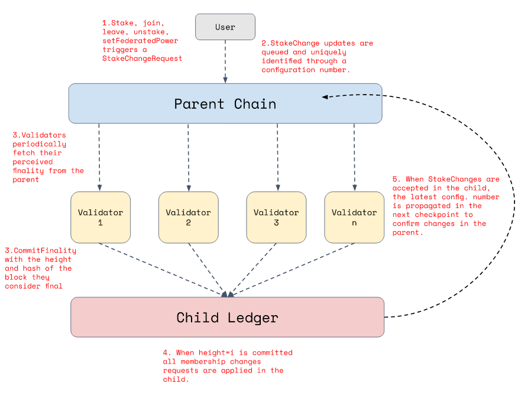
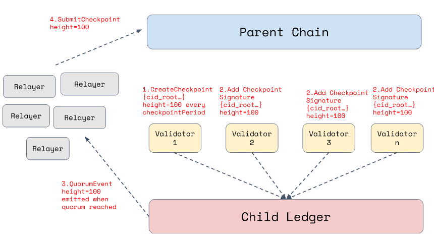

# Ipc Actors

## Architecture Design

- An IPC instance is always rooted from an EVM-compatible network (in our case Filecoin).
- Users are allowed to deploy new subnets from any of the subnets in the hierarchy (as long as the corresponding subnet has the feature enabled).
- The protocol is recursive. The whole protocol is designed so that it can be explained as a set of simple parent-child interactions.

### High-level architecture

- The on-chain logic for IPC is implemented in two contracts, the IPC gateway and the subnet actor, as well as an auxiliary contract use for UX purposes, the registry.
    - The gateway is a singleton actor that lives in every IPC subnet and implements the common logic for IPC. It is responsible for managing the collateral of subnet, enforcing the firewall requirement, and the cross-net interactions.
    - The subnet actor is a user-defined actor that implements the specific logic of a subnet. This contract is deployed in the parent from which the child subnet wants to be deployed. There is one subnet-actor for each child subnet in the parent.
    - The subnet registry behaves as a subnet actor factory that offers users a convenient way of deploying instances of the reference implementation of the subnet actor in a network.

### Software stack

The peer implementation of IPC is Fendermint, an IPLD-enabled blockchain based on an ABCI++ application on top of CometBFT and the FVM. All child subnets deploy Fendermint for their nodes. Fendermint implements modules for all the processes described below, and leverages the on-chain logic of IPC for its operation.

- All the interactions between modules is performed through an ETH RPC (in the current state).that offers users convenient way to deploy the reference implementation of a subnet actor
- Relayers are small processes that any user can run to relay bottom-up information.

### Create a subnet

To create a subnet, users need to:

- Deploy a subnet actor to govern their child subnet in the parent from which they want to deploy their network.
    - They can deploy an instance of the reference implementation of the subnet actor through the registry
- Bootstrap the subnet so they can deploy the infrastructure and start creating new blocks.
    - If the subnet is `federated` the subnet expects a first `setFederatedValidators` to determine the initial membership of the subnet.
    - If the permissioned mode is `Collateral` a minimum number of validators and collateral need to `join` the subnet for the subnet to be registered and be bootstrapped.
- When the subnet is bootstrapped, the subnet actor calls `register` in the gateway to register the subnet to IPC.
- From there on, the subnet infrastructure can be deployed.
    - Every child subnet deploys at genesis its own instance of the IPC gateway and the registry.

### Top-down messages and parent finality

- Validators in the child subnet periodically listen to new blocks from the parent.
- As part of the consensus algorithm in the child, the leader of the consensus proposes the height and hash of the block that they currently consider final in the parent.
- The rest of the validators agree or reject this finality from the parent as part of the process of voting the validity of a block (i.e. validators implicitly agree on the finality of the parent through the block validation).
- As part of the execution of the block, validators implicitly commit the finality seen in the parent. This triggers the execution of all top-down messages from the latest finality to the one committed, as well as any changes on the validator set or collateral that may need to be propagated down.
- When a user performs a top-down message, it is added to a queue in the parent chain. Top-down messages are indexed in the parent by the height where they were committed. This index is used by child subnet validators to determine when a top-down message commitment can be considered as final and their execution can be triggered in the child (when their corresponding finality has been triggered).

### Stake, Leave and membership changes

- When a user performs any change that triggers a membership change (join, leave, stake, unstake, setFederatedPower), a new `StakeChangeRequest` is triggered.
    - These requests are uniquely identified through a configuration number.
- Changes into the stake in the parent need to be explicitly confirmed by the child validators.
- New membership change requests are propagated through the commitment of parent finality (as it happens for top-down messages –see section above–).
- When the parent finality for some height is committed, the child subnet executes the membership requests and triggers all the configuration changes.
- To confirm the changes in the parent, child validators propagate the latest configuration number adopted as part of the membership change in the checkpoint.
    - The commitment of this checkpoint in the parent will trigger the confirmation of collateral/federated power change.

### Checkpoint submission

- Every `checkpointPeriod` validators of a child subnet populate a checkpoint and call `CreateCheckpoint` on their subnet.
- When a checkpoint is created, a majority of the validators need to `addCheckpointSignature` for that checkpoint.
- Once a quorum is reached, the gateway in the child subnet emits a `QuorumEvent` to notify relayers that there has been an agreement on a new checkpoint, that can be propagated to the parent.
- The relayers query the `QuorumEvent` and call `submitCheckpoint` in the parent providing the quorum certificate (list of signatures) for that checkpoint, committing it in the parent.

### Bottom-up messages

- When users trigger bottom-up messages, they are included in a queue in the child ledger.
- Similar to how it is done for checkpoints, every `batchPeriod` validator call `CreateBatch` to create a batch of bottom-up messages to be propagate up till that child's height.
- Once a new batch is created, a majority of validators need to add their signature. When quorum is reached, a new `QuorumEvent ` for the batch of messages is triggered.
- Relayers listen to these events, and they will pick up the batch with its signature bundle and propagate it for execution in the parent by calling `SubmitBatch` in the gateway.
- Alternatively, bottom-up message batches are configured in a subnet with a `MAX_MSGS_PER_BATCH`. If before the `batchPeriod` is reached, MAX_MSGS_PER_BATCH is reached for that period, a new intermediate batch is created.
    - Validators would reach quorum normally.
    - And the outstanding messages would be queued for the batch coming in the next checkpoint period.

## IPC Implementation

- IPC Solidity Actors utilize the Diamond pattern for implementation and is based on the [diamond-1-hardhat](https://github.com/mudgen/diamond-1-hardhat/tree/main/contracts) reference implementation. The Diamond pattern is defined by [EIP 2535](https://eips.ethereum.org/EIPS/eip-2535) and the reference implementation of the Diamond library that IPC imports is [here](https://github.com/mudgen/diamond-1). The mechanics of the diamond pattern that is used by IPC is such that for each actor there is a diamond with storage, constructor params, constructor, and a list of facet addresses and function signatures. Facets contain functions that can be called as part of the diamond.

### Code Layout

Facets

- Facets for SubnetActor are organized within the *subnet* directory
- Facets for Gateway are located in the *gateway* directory
- Facets for SubnetRegistry are in the *subnetregistry* directory

Diamond Contracts:

- GatewayDiamond.sol and SubnetActorDiamond.sol serve as the primary diamond contracts
- SubnetRegistryDiamond.sol implements the registry

Libraries:

- Libraries located in the lib directory, these libraries house functionalities that are either too extensive for a facet or need to be accessible across multiple facets
- lib/LibSubnetActor.sol and lib/LibGatewayActorStorage follow the AppStorage pattern
- A specialized version of lib/ReentrancyGuard.sol is employed, diverging from the standard OpenZeppelin's ReentrancyGuard to accommodate the Diamond pattern.

Storage Mechanism:

- The AppStorage pattern is prevalent in facets, while Diamond Storage is used within libraries
- GatewayActorStorage and SubnetActorStorage integrate within the AppStorage framework
- The LibReentrancyGuard contract is essential for compatibility with the AppStorage pattern
